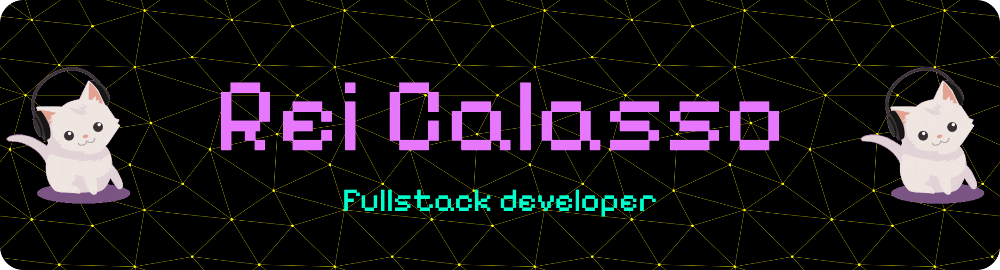

  <!-- Banner -->
  

    

  <!-- Avatar -->
  

  <h1>Arda Hakbilen (<strong>Kael Valen</strong>)</h1>
  
<em>ML Architecture Researcher · Non-Transformer Models · Systematic Learning</em>

  <!-- Typing SVG -->
   
  
   
   
   

  <!-- Focused Badges -->
  

    
    
    
  

   

  <!-- Research Statement -->
  

    <em>
      Researching <strong>non-transformer architectures</strong> through systematic implementation. 
      Not just reading papers — building Mamba, RWKV, Flash Attention from scratch. 
    </em>
  

   

  <!-- Socials -->
  

    
    
    
  

---

  <h2>GitHub Analytics & Activity</h2>
  
<em>Tracking systematic learning through daily commits</em>

   

    

<!-- 3D Contribution Graph -->

  <h2>3D Contribution Graph</h2>
  

  <!-- Generated by .github/workflows/metrics.yml -->
  

 

<!-- Snake Animation Placeholder (Will be generated by GitHub Action) -->

  

 

---

## Research & Core Focus

### **Beyond Transformer: Alternative Sequence Architectures**
> Questioning the assumption that transformers are the only viable solution

-   **State-Space Models** → Mamba & RWKV implementations
    -   Linear-time inference vs quadratic attention complexity
    -   Selective state mechanisms for efficient memory
    -   Comparing trade-offs: speed vs expressiveness

-   **Hybrid Architectures** → RNN + Attention combinations
    -   Exploring best of both worlds: recurrence + selectivity
    -   Custom memory systems for long-context tasks
    -   Implementation-first approach to understanding

-   **Flash Attention v2** → From-scratch CUDA optimization
    -   Understanding memory-efficient attention at kernel level
    -   Production inference optimization
    -   10x speedup through proper memory access patterns

---

## Featured Projects

<table>
  <tr>
    <td width="50%">
      <h3>Beyond Transformer</h3>
      
<strong>Open-source alternative architecture research</strong>

      

        Implementation-first approach to understanding non-transformer models. Building Mamba, RWKV, and hybrid systems from scratch to compare trade-offs.
      

      

        <code>PyTorch</code> <code>JAX</code> <code>CUDA</code> <code>ONNX</code>
      

      

        
      

      

        <strong>Current Phase:</strong> 
        • Flash Attention v2 from scratch 
        • Mamba state-space model analysis 
        • RWKV architecture comparison
      

    </td>
    <td width="50%">
      <h3>Learning Tracker</h3>
      
<strong>Structured habit & progress management</strong>

      

        SQLite-based system for breaking vibe coding habits. Daily plans, evening reports, focus zone management, and streak tracking with AI coach integration.
      

      

        <code>Python</code> <code>SQLite</code> <code>CLI</code> <code>Anthropic API</code>
      

      

        
      

      

        <strong>Features:</strong> 
        • GREEN/RED focus zone tracking 
        • Morning planning + evening review 
        • AI coach for accountability
      

    </td>
  </tr>
  <tr>
    <td width="50%">
      <h3>SentinelFS</h3>
      
<strong>Distributed P2P File Sync (Archived)</strong>

      

        Autonomous peer-to-peer synchronization with ML-based anomaly detection, delta-sync algorithms, and genetic topology remeshing for fault tolerance.
      

      

        <code>C++17</code> <code>Threading</code> <code>P2P</code> <code>ML</code>
      

      

        
      

      

        <strong>Key Features:</strong> 
        • ML anomaly detection pipeline 
        • Self-healing network topology 
        • Zero-copy delta sync protocol 
        • Byzantine fault tolerance
      

    </td>
    <td width="50%">
      <h3>Research Blog (Planned)</h3>
      
<strong>Implementation Notes & Architecture Analysis</strong>

      

        Documenting learning journey: from-scratch implementations, architecture comparisons, and trade-off analysis. Focus on practical insights over theory.
      

      

        <code>Markdown</code> <code>GitHub Pages</code> <code>Technical Writing</code>
      

      

        
      

      

        <strong>Planned Topics:</strong> 
        • Mamba vs Transformer trade-offs 
        • Flash Attention internals 
        • CUDA kernel optimization 
        • JAX vs PyTorch for research
      

    </td>
  </tr>
</table>

---

## Tech Stack & Tools

  <table>
    <tr>
      <td align="center" width="140"><strong>ML Frameworks</strong></td>
      <td>
        
        
        
        
      </td>
    </tr>
    <tr>
      <td align="center" width="140"><strong>Research Tools</strong></td>
      <td>
        
        
        
        
      </td>
    </tr>
    <tr>
      <td align="center" width="140"><strong>Core Languages</strong></td>
      <td>
        
        
        
        
      </td>
    </tr>
    <tr>
      <td align="center" width="140"><strong>Infrastructure</strong></td>
      <td>
        
        
        
        
      </td>
    </tr>
    <tr>
      <td align="center" width="140"><strong>Web Stack(I'm not happy about this, ngl)</strong></td>
      <td>
        
        
        
        
      </td>
    </tr>
  </table>

---

## Current Research & Learning Path

<table>
  <tr>
    <td width="33%" valign="top">
      <h3>Active Implementation</h3>
      <ul>
        <li><strong>State-Space Models</strong> 
        Mamba & RWKV from-scratch builds</li>
        <li><strong>Flash Attention v2</strong> 
        CUDA kernel-level understanding</li>
        <li><strong>Hybrid RNN-Attention</strong> 
        Exploring architecture combinations</li>
      </ul>
    </td>
    <td width="33%" valign="top">
      <h3>Next Phase (Q2 2025)</h3>
      <ul>
        <li><strong>CUDA Optimization</strong> 
        Custom kernels for inference</li>
        <li><strong>JAX Deep Dive</strong> 
        Functional programming for ML</li>
        <li><strong>Quantization Research</strong> 
        INT4/INT8 with minimal loss</li>
        <li><strong>Production Inference</strong> 
        Deployment-ready pipelines</li>
      </ul>
    </td>
    <td width="33%" valign="top">
      <h3>Philosophy</h3>
      <ul>
        <li><strong>Implementation First</strong> 
        Build it before believing it</li>
        <li><strong>Question Assumptions</strong> 
        Why transformers for everything?</li>
        <li><strong>Systematic Learning</strong> 
        No vibe coding, structured roadmap</li>
        <li><strong>Trade-off Analysis</strong> 
        Speed vs accuracy vs memory</li>
      </ul>
    </td>
  </tr>
</table>

---

## Collaboration & Contact

  

    <strong>Open to research collaboration & technical discussions</strong> 
    Interested in alternative architectures, efficient inference, or systematic ML learning?
  

  

    <strong>What I'm looking for:</strong> 
    • Co-researchers on non-transformer architectures 
    • Code review & implementation feedback 
    • Trade-off discussions: speed vs accuracy vs memory
  

  

    <strong>What I'm not interested in:</strong> 
    ❌ Wrapper apps without novel architecture 
    ❌ "Just use ChatGPT API" projects 
    ❌ Hype-driven development
  

   

  

    
    
    
  

  

    <em>"Implementation over theory. Trade-offs over hype. Systematic learning over vibe coding."</em>
  

   

  
    Star repos if you find them useful | Building in public
  

