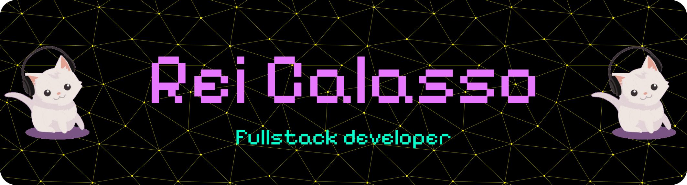

  

   

  <h1>Mehmet Arda Hakbilen <strong>(Kael Valen)</strong></h1>
  
<em>Software Engineer · ML Systems & Efficient Architectures · Student</em>

   

  

    
    
    
  

   

  

    
    
  

---

## What I'm Working On

I'm interested in the intersection of **model architecture** and **inference efficiency** — why modern sequence models are designed the way they are, where they fail, and whether simpler alternatives can close the gap.

Right now my main project is [**PRISM**](https://github.com/kaelvalen/prism) — a modality-agnostic sequence architecture that processes ECG signals and image patches through one shared backbone built from interleaved S4D-Complex and Gated Delta Rule blocks. The hybrid run hits **88.4% on CIFAR-10** with ~8M params; ablations and PTB-XL ECG benchmarks are running.

**Current focus areas:**
- State-space models (S4D, complex diagonal SSMs) and associative memory (delta rule, fast weights)
- Hybrid sequence architectures — when interleaving beats either component alone
- Hardware-aware algorithm design (parallel scan, chunked recurrence, memory hierarchy)
- Modality-agnostic backbones — testing how far a single design generalizes across signal types

---

## Projects

### [PRISM — Parallel Recurrent Integrated Signal Model](https://github.com/kaelvalen/prism)
`PyTorch` `SSM` `Delta Rule` `Research` · **Active**

A modality-agnostic sequence model: 12-layer hybrid backbone interleaving S4D-Complex blocks (continuous-time signal dynamics) with Gated Delta Rule blocks (matrix-valued associative memory) at a 3:1 ratio. Same backbone handles 12-lead ECG, image patches, and arbitrary continuous signals — only the input projection and output head are per-modality. CIFAR-10: 88.4% val acc on the hybrid config.

### [PULSE — Parallel Unified Linear State Engine](https://github.com/kaelvalen/beyond_transformer)
`PyTorch` `Python` `Research` · **Experimental**

Earlier exploration of a single O(n) primitive (local convolution + linear attention + gated fusion + key-value memory) as a transformer alternative. Predates PRISM. Useful as a study repo; see the README for current status and known limitations.

---

## Tech Stack

<table>
  <tr>
    <td><strong>ML / Research</strong></td>
    <td>
      
      
      
      
    </td>
  </tr>
  <tr>
    <td><strong>Languages</strong></td>
    <td>
      
      
      
      
    </td>
  </tr>
  <tr>
    <td><strong>Web</strong></td>
    <td>
      
      
      
    </td>
  </tr>
  <tr>
    <td><strong>Infra</strong></td>
    <td>
      
      
      
    </td>
  </tr>
</table>

---

## GitHub Activity

  
    
  

---

  Open to research collaboration, architecture discussions, and code review. Not interested in wrapper apps or hype-driven projects.

